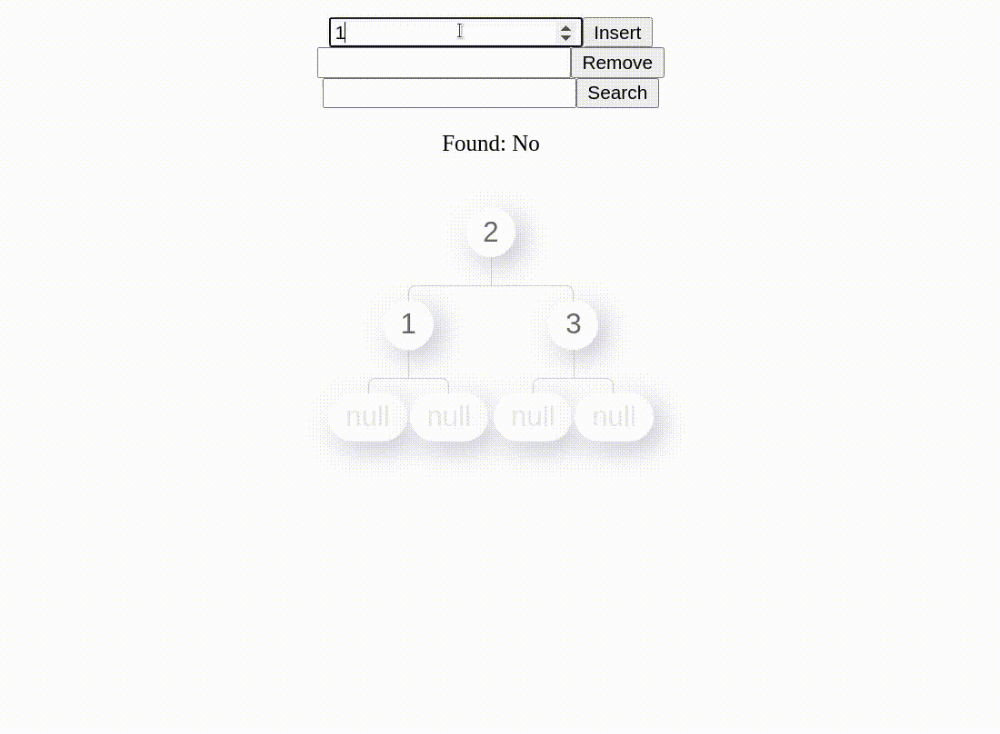

<h1 align="center">Welcome to React Tree Vis 👋</h1>
<p align="center">
  
  
  <a href="https://github.com/VandanRogheliya/react-tree-vis#readme" target="_blank">
    
  </a>
  <a href="http://www.typescriptlang.org/" target="_blank">
    
  </a>
  <a href="https://github.com/VandanRogheliya/react-tree-vis/graphs/commit-activity" target="_blank">
    
  </a>
  <a href="https://github.com/VandanRogheliya/react-tree-vis/blob/master/LICENSE" target="_blank">
    
  </a>
</p>
<p align="center"> 
  
<p/>

> Allows you to store and manage information in different tree data structures.

### ✨ [Storybook](https://vandanrogheliya.github.io/react-tree-vis)

### :video_game: [Code Sandbox](https://codesandbox.io/s/react-tree-vis-simple-example-h7rh8?file=/src/App.js)

### :gift: [NPM](https://www.npmjs.com/package/react-tree-vis)

## Features

- :package: Only 11kb minified & gzipped / no dependencies
- :hammer_and_wrench: Perform tree operations with a simple function call
- :rocket: Components made with only JSX and CSS
- :nail_care: Make the components of your own with styling options

## Data Structures Covered

- Binary Search Tree
- Red Black Tree
- AVL Tree
- Trie
- Min Heap
- Max Heap
## Who is this library for?

If you are looking for a way to not just only display your data in a tree format but also interact with it, react-tree-vis might be for you. You can simply pass an array of values to display it or use our API to insert, delete, search and much more. With react-tree-vis, you can style your tree component with props or override with CSS. Everything is documented on [storybook](https://vandanrogheliya.github.io/react-tree-vis)! Also, I would recommend checking out other similar libraries too.

## Documentation

### Installation

```sh
# Yarn
yarn add react-tree-vis

# NPM
npm install react-tree-vis
```

### ✨ Checkout the stories [here](https://vandanrogheliya.github.io/react-tree-vis/?path=/story/tree-avl-tree--simple-example) for a detailed documentation.

### Quick start

We are displaying data in BST and interacting with it using `useBinarySearchTree`. Play around with this example [here](https://codesandbox.io/s/react-tree-vis-simple-example-h7rh8?file=/src/App.js).

```js
import { BinarySearchTree, useBinarySearchTree } from 'react-tree-vis'
import { useState } from 'react'

export default function App() {
  const { ref, insert, remove } = useBinarySearchTree()

  const [insertValue, setInsertValue] = useState(0)
  const [removeValue, setRemoveValue] = useState(0)

  return (
    <div className="App">
      <input
        type="number"
        onChange={(elem) => setInsertValue(parseInt(elem.currentTarget.value))}
      />
      <button onClick={() => insert(insertValue)}>Insert</button>
      <br />
      <input
        type="number"
        onChange={(elem) => setRemoveValue(parseInt(elem.currentTarget.value))}
      />
      <button onClick={() => remove(removeValue)}>Remove</button>

      <BinarySearchTree data={[2, 1, 3]} ref={ref} />
    </div>
  )
}
```

## Development

### Install

```sh
yarn install
```

### Develop

```sh
yarn storybook
```

### Run tests

```sh
yarn test
```

## Author

👤 **Vandan Rogheliya**

- Twitter: [@vandan_roghelia](https://twitter.com/vandan_roghelia)
- Github: [@VandanRogheliya](https://github.com/VandanRogheliya)
- LinkedIn: [@vandanrogheliya](https://linkedin.com/in/vandanrogheliya)

## Show your support

Give a ⭐️ if this project helped you!

## 📝 License

Copyright © 2021 [Vandan Rogheliya](https://github.com/VandanRogheliya).<br />
This project is [MIT](https://github.com/VandanRogheliya/react-tree-vis/blob/master/LICENSE) licensed.
